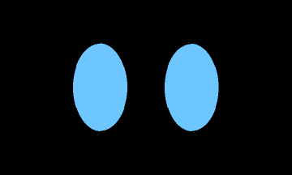
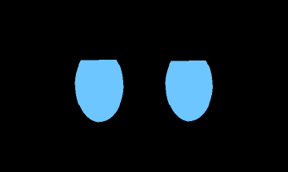
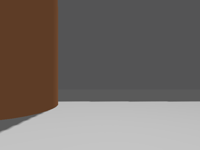

# burg-bot

A TurtleBot3-Burger-style differential-drive robot running ROS 2 Jazzy, with a
full autonomy stack, an expressive animated face, and camera-based semantic
mapping.

The robot maps a space on its own — no joystick, no waypoints — while a 7"
display gives it a face that reacts to what it is actually doing, and a depth
camera labels the objects it finds and pins them to the map.

<p align="center">
  
  
</p>

**Left:** autonomous frontier exploration in Gazebo. The occupancy grid fills
in from the lidar, the orange trail is the robot's actual driven path, the blue
square is the robot, and the dark disc is the obstacle it routes around.
**Right:** the procedural face cycling its expression library.

---

## Credit

The physical robot design and the foundational ROS 2 packages come from
**Antonio Brandi's** excellent course, *Self-Driving and ROS 2 — Learn by Doing!
Plan & Navigation*:

- Course: <https://www.udemy.com/course/self-driving-and-ros-2-learn-by-doing-plan-navigation/>
- Source: <https://github.com/AntoBrandi/Self-Driving-and-ROS-2-Learn-by-Doing-Plan-Navigation>

This repository builds on that foundation. The split is:

| Derived from the course | Original to this repository |
| --- | --- |
| `burgerbot_description` — URDF, meshes, Gazebo | `burgerbot_face` — procedural face renderer |
| `burgerbot_controller` — diff-drive, twist_mux | `burgerbot_expressions` — mood arbiter, gestures |
| `burgerbot_firmware` — Pico interface, IMU | `burgerbot_exploration` — frontier exploration |
| `burgerbot_localization` — EKF, AMCL | `burgerbot_perception` — detection, semantic map |
| `burgerbot_mapping` — slam_toolbox | `burgerbot_msgs` — expression/semantic interfaces |
| `burgerbot_navigation` — Nav2 configuration | Docker dev environment, Gazebo testbed |
| `burgerbot_utils` — lidar safety stop | `screen_link` / camera additions to the URDF |

Course exercise code that the production stack supersedes (hand-written A*,
Dijkstra, pure-pursuit and PD controllers, a from-scratch Kalman filter and
occupancy-grid mapper) has been removed — Nav2, `robot_localization` and
`slam_toolbox` do those jobs here. Those implementations are worth studying in
the original repository.

---

## Hardware

| Part | Notes |
| --- | --- |
| Raspberry Pi 4 (4 GB) | Main compute, Ubuntu 24.04 Server |
| Raspberry Pi Pico | Motor control and encoders over serial |
| DC motors + encoders | Differential drive |
| 2D lidar | SLAM and obstacle avoidance |
| MPU6050 IMU | Fused with wheel odometry via EKF |
| Official Pi 7" touch display | The face, over DSI ribbon |
| Intel RealSense D435 | Object detection and 3D projection |

The Pi 4 has no GPU or NPU, which shapes the perception design: inference is
throttled to ~1.5 Hz rather than run per frame, because objects worth labelling
on a map do not move fast.

---

## What it does

### Autonomous mapping

`burgerbot_exploration` finds the boundaries between known-free and unknown
space, scores each by size and distance, and sends the winner to Nav2. It stops
when no frontier remains — which is also what guarantees no unexplored pockets
are left behind.

Frontier detection and scoring are pure functions over an occupancy grid
(`frontier.py`), unit-tested on synthetic grids with no ROS graph running. The
node is a thin wrapper that reads the map, calls into that module, and
dispatches goals.

### Expressive face

Two light-blue ovals on black. No mouth — people read eyes far more strongly
than mouths, and a face with no mouth never lands in the uncanny valley of a
bad one. Every emotion comes out of eye geometry, timing, and motion.

<p align="center">
  
</p>

Expression is honest telemetry, not decoration. Each mood traces back to
something true about the robot: navigation status, lidar proximity, pose
covariance, battery level, touch. Sources bid with a priority and an expiry and
exactly one wins, the same shape as `twist_mux` arbitrating velocity commands —
without that, the face flickers between competing sources and reads as broken
rather than alive.

During a mapping sweep the face is neutral on a clean run and **nervous** —
narrowed, with fast sway and quick blinks — when something comes within half a
metre.

### Semantic mapping

<p align="center">
  
</p>

A YOLOv8n detector runs on the colour stream; detections are back-projected to
3D using the aligned depth image and a pinhole model, transformed into the map
frame, and folded into a persistent de-duplicated object layer that saves as
`objects.yaml` alongside the SLAM map.

The object layer is deliberately parallel to the occupancy grid rather than
part of it — a probability grid is not a place to store "this cell is a chair."

### Companion behaviour

The robot notices people, goes over to them, is visibly pleased to be there,
occasionally dances, and stops bothering anyone who keeps walking away from it.

Furniture and people need different machinery, which is why people get their own
pipeline rather than a filter on the object one. Semantic mapping averages every
sighting of a thing into one position — exactly right for a chair, nonsense for
somebody walking across a room — and it wants to remember what it saw an hour
ago, where a companion needs to know where you are *now*. So `person_tracker`
runs a constant-velocity alpha-beta filter with gating, coasting through brief
occlusions, and a confirmation count that stops a coat over a chair becoming
somebody the robot goes to greet.

Three things then decide the behaviour, all in `social.py` with no ROS in it:

**Who to attend to.** Scored, not nearest-wins: somebody walking past at a metre
is nearer than somebody across the room looking straight at the robot, and the
second is unambiguously the better choice. Body orientation from pose keypoints
is what separates those, and it costs almost nothing once a pose model is
running. With no keypoints the tracker reports engagement as 0.5 — "no
information" — which sits below the threshold to approach, so the robot watches
rather than advances. That is the right way to be wrong.

**Where to stand.** It stops at about 1.1 m and approaches from within 60° of
your front, swinging round the short way rather than arriving at your back.
Cheap to implement and the single biggest thing that makes a mobile robot read
as socially aware rather than merely present.

**When to be sad.** This is the one with a real risk of being wrong, and being
wrong is expensive — a robot that reads ordinary passing traffic as rejection
mopes constantly and is tiresome within an hour. So rejection is defined
narrowly: measured only during an approach the robot actually committed to, and
only from the person's *own* outward motion, integrating the component of their
velocity along the line of sight. That excludes the robot's own approach, so
driving toward somebody stationary never reads as them leaving, and it excludes
anybody walking across the robot's view rather than away from it. One walk-away
is a flicker of disappointment; three is a pattern, and the robot withdraws,
looks properly sad, and leaves that person alone for a couple of minutes.

Dancing is deliberately occasional. A robot that dances every time somebody
comes near is a vending machine with a mechanism; one that dances sometimes,
more readily for people it has spent time with, is a character. So a dance needs
a long cooldown, a person actually facing it, positive affinity, and then a coin
toss. The dances themselves are authored as pure functions of time in
`gestures.py` alongside the existing library, each segment integrating to zero
net yaw — a dance is the gesture most likely to be cut short by the feasibility
gate, and one that only balances if it runs to completion would rotate the robot
slightly every time it did not.

Two smaller pieces round it out. Face embeddings put names to tracks, by vote
over many frames rather than per-frame lookup, because a wrong name is far worse
than no name — the robot greets the wrong person and starts filing its memories
under somebody else. And a **person heatmap** accumulates where people actually
are into a layer over the SLAM map, so "nobody is around" stops meaning "wander"
and starts meaning "go and wait where people turn up". A kitchen and a corridor
are identical on an occupancy grid and could not be less alike socially.

The whole package sits on top of everything else and is required by none of it.
Expression goes through the mood arbiter, body motion through the gesture
server's feasibility gate, approaches through Nav2 — so every existing
arbitration and safety layer still applies to a robot that has started following
people around.

### Talking to it

A local language model runs the conversation. Text in, text out — there is no
microphone or speaker on this robot, and building against a keyboard first is
not a compromise: it is how a prompt gets tuned in milliseconds instead of
seconds, and audio later bolts onto the same two topics.

The model produces **intent and nothing else**. What it asks for goes through
machinery that already exists and already refuses when it should — the face
through the mood arbiter, so a flat battery still outranks conversation; the
body through the gesture server, so its lidar gate still declines a dance there
is no room for; and a destination through `burgerbot_companion`, which keeps
sole ownership of the Nav2 client. A model that hallucinates cannot produce a
velocity command. That is the same split as `gestures.py`/`gesture_server.py`
and `social.py`/`social_behavior.py`, applied a third time, and it is the reason
a VLA would be the wrong shape here: a policy that outputs actions collapses
exactly the separation that makes this safe.

Three things get more care than they look like they need:

**The validator degrades per field, not per reply.** Small models get the enums
wrong far more often than they get the prose wrong, so a hallucinated gesture
name drops the gesture and keeps the sentence. Throwing away a good reply over
one bad enum is what makes a companion feel broken. `schema.py` also copes with
markdown fences, prose either side of the JSON, and braces inside the utterance
— all shapes a local model actually returns.

**Silence is handled explicitly.** Past a beat the robot breaks gaze and looks
focused, which on a mouthless face is the strongest "working on it" signal
available. Past a few seconds it says something from a static list — no model
involved, because that has to work when the model is the thing that is broken.
After repeated failures it stops calling at all for a minute, which turns a dead
endpoint from an eight-second silence *every turn* into one honest "my head is
offline".

**Gestures are rate limited.** Small instruct models are bad at leaving optional
fields out; they fill in everything. A model asking for a gesture on every turn
is the expected case, and a robot twitching on every sentence is unwatchable.

There are no room labels, so "go to the kitchen" resolves against places you
taught it — drive there and name it — then against tracked objects, then
against the person heatmap. Nothing infers that a region *is* a kitchen; when a
name matches nothing the robot says so and asks to be shown, which is both the
honest answer and the prompt that teaches it.

### Offloading to a control PC

The Pi 4 detects at 1.5 Hz, which is ample for labelling a chair and marginal
for following a person: at a walking pace somebody covers most of a metre
between frames. Everything works at that rate, and works better on a GPU.

The split is asymmetric on purpose. Compressed colour goes **up** to the PC, and
small detection messages come **back**; depth never leaves the robot, because it
is the largest stream, the least compressible, and the only thing that needs it
(`person_tracker`, which also needs the TF tree) is already sitting next to it.
A 640×480 RGB stream at 15 fps is about 110 Mbit/s raw — a Pi on WiFi cannot
sustain that, and it would starve the rest of the ROS graph long before it
saturated the link. The same stream as JPEG is a couple of megabits.

No new protocol, no bridge: both machines join the same `ROS_DOMAIN_ID` and the
nodes do not know or care which host they are on.

On the robot:

```bash
ros2 launch burgerbot_perception people.launch.py detector:=none publish_compressed:=true
```

On the PC:

```bash
ros2 launch burgerbot_perception people.launch.py detector:=gpu tracker:=false use_identity:=true
```

One hardware note, because the failure is misleading. An RTX 5070 Ti is
Blackwell (`sm_120`), which needs CUDA 12.8 or newer and a matching PyTorch
build. An older wheel installs and imports perfectly happily, then fails at the
first kernel launch with *"no kernel image is available for execution on the
device"* — which reads like a broken model rather than a version mismatch.
`person_detector_gpu` checks `torch.cuda.get_arch_list()` at startup and says so
plainly instead.

---

## Verified results

From the Gazebo testbed (`test_room.world`, a 4×4 m room with one obstacle and
a chair), all committed under `burgerbot_ws/src/burgerbot_mapping/maps/test_room/`:

- **Mapping:** 81×81 cells at 5 cm resolution — a 4.05 m square, matching the
  room as designed.
- **Detection:** the chair recognised at 0.88–0.95 confidence.
- **Semantic map:** tracked to `(-1.42, -1.32, 0.42)` against a true placement
  of `(-1.2, -1.2)`, from 9 observations.

The ~0.2 m offset is expected: depth is sampled at the bounding-box centre, so
the point lands on whichever surface faces the robot, not the object's centroid.

---

### Warehouse world

A second, much larger environment — roughly 25 × 40 m of industrial space with
shelving rows, pallets and a parked Tugbot, assembled from OpenRobotics'
*Tugbot in Warehouse* Fuel models, which download and cache on first launch.

<p align="center">
  
</p>

Shelf rows in black, aisles in white, the robot's driven path in orange. Run
it with:

```bash
ros2 launch burgerbot_bringup testbed.launch.py \
    world_name:=tugbot_warehouse \
    map_topic:=/global_costmap/costmap \
    goal_timeout:=240.0
```

Two of those arguments carry the interesting caveats.

`goal_timeout` scales with the space rather than the robot: a warehouse
frontier can be 20 m away, far longer than the room-sized default allows, and
a goal that times out is blacklisted as unreachable even while the robot is
driving toward it perfectly well.

`map_topic` is a workaround, and worth being straight about. **`slam_toolbox`
does not grow its map in this world** — it holds at roughly 1,000 free cells
indefinitely, so there is never a frontier to drive to. Pointing the explorer
at Nav2's global costmap instead sidesteps that: the costmap fuses the same
`/scan` data live, publishes in the same `map` frame and the same occupancy
encoding, and is demonstrably accurate here. The robot explores properly on
it, covering roughly 18 × 18 m in the run above.

The trade is real. The costmap is rolling, robot-centric and has no loop
closure, so it is a diagnostic and demo path, not a substitute for SLAM. On
`test_room`, where `slam_toolbox` works normally, leave `map_topic` at its
`/map` default.

The underlying SLAM failure is unexplained. Ruled out by measurement, not
assumption: sensing (278 of 360 beams returning 3.15–11.92 m), robot placement
(the onboard camera shows it correctly in the aisle), being physically stuck
(a 1.18 rad odometry turn matched a 3.28 m mean change in the scan), the
bootstrap rotation (the failure predates that code), CPU starvation (real-time
factor was 1.00), TF (the transform SLAM needs resolves for 162 of 164 scans),
message timestamps (0.20 s lag in the warehouse versus 0.14 s in the working
room), and a second lidar colliding on `/scan` (twelve consecutive scans are
homogeneous at exactly the configured 5 Hz, and the Tugbot's own sensors sit
on scoped topics).

Two genuine exploration bugs did surface while chasing it, both affecting any
large or slow-loading world:

- Completion was declared against an all-unknown map, before SLAM had
  processed its first scan, and that completion latched permanently. It now
  waits for real free space and recovers if a frontier reappears.
- A standing start could deadlock: no map means no frontier, no frontier means
  no goal, no goal means no motion, and `slam_toolbox` needs 0.5 m of motion
  before taking another scan. The explorer now rotates in place to break that
  cycle. `test_room` only ever escaped it by luck, its first frontier landing
  at 0.46 m against a 0.4 m floor.

## Quick start

Everything runs in a container — the workspace targets Ubuntu 24.04 / ROS 2
Jazzy, which need not match your host.

Setting up the real robot, or a control PC with a GPU, is a different job with
its own pitfalls — udev rules for the serial devices, DRM permissions for the
face panel, CUDA versions, and getting two machines into one ROS graph over
WiFi. That is all in **[docs/INSTALL.md](docs/INSTALL.md)**.

```bash
docker compose run --rm dev bash
```

Then inside:

```bash
cd /workspace/burgerbot_ws && colcon build --symlink-install && source install/setup.bash
```

Autonomous mapping demo (Gazebo + SLAM + Nav2 + exploration + face):

```bash
ros2 launch burgerbot_bringup testbed.launch.py
```

Add object detection and semantic labelling:

```bash
ros2 launch burgerbot_bringup testbed.launch.py use_perception:=true
```

Companion demo — an 8×6 m room with two walking actors, one who comes over and
one who keeps leaving:

```bash
ros2 launch burgerbot_bringup testbed.launch.py world_name:=social_room use_companion:=true
```

`use_companion` implies `use_perception` and turns exploration off: both
dispatch goals to Nav2 and the last one to send wins, so running them together
is two behaviours taking turns at random rather than a blend of them.

Watch what it is thinking, and why:

```bash
ros2 topic echo /companion/social_state
```

Stop it doing whatever it is doing around people, without restarting anything:

```bash
ros2 topic pub --once /companion/enable std_msgs/Bool "{data: false}"
```

Teach it a face (stand in front of the camera and turn your head slowly; the
call blocks while it captures):

```bash
ros2 service call /face_identity/enroll burgerbot_msgs/srv/EnrollPerson "{name: mark}"
```

Talk to it (needs a model server — see
[docs/INSTALL.md](docs/INSTALL.md) section C):

```bash
ros2 launch burgerbot_bringup testbed.launch.py world_name:=social_room use_dialog:=true
```

then, in a second terminal:

```bash
ros2 run burgerbot_dialog dialog_cli
```

Teach it somewhere by driving there and naming it. This is what makes "go to
the kitchen" mean anything — nothing infers room labels:

```bash
ros2 service call /dialog_manager/name_place burgerbot_msgs/srv/NamePlace "{name: kitchen}"
```

On the real robot:

```bash
ros2 launch burgerbot_bringup real_robot.launch.py
```

Tune the face with no robot and no ROS graph attached:

```bash
ros2 run burgerbot_face demo_expressions
```

### Object detection model

The detector needs a TFLite model, which is generated rather than committed:

```bash
./scripts/export_detection_model.sh
```

This exports YOLOv8n through ONNX and `onnx2tf`. It ships the **float32**
variant. The int8 model is also produced but is not loadable: XNNPACK cannot
delegate its quantized Transpose ops, and with the delegate disabled the
reference sigmoid kernel rejects its output scale (it requires exactly 1/256).
No delegate setting satisfies both. At the pipeline's 1.5 Hz throttle, float32
fits a Pi 4 comfortably.

---

## Repository layout

```
burgerbot_ws/src/
  burgerbot_bringup       Top-level launches: real robot, simulation, testbed
  burgerbot_companion     Social behaviour, person heatmap, per-person memory
  burgerbot_controller    Diff-drive control, twist_mux, noisy-odometry demo
  burgerbot_dialog        Local-LLM conversation, place naming
  burgerbot_description   URDF, meshes, Gazebo worlds (test_room, social_room, tugbot_warehouse)
  burgerbot_exploration   Frontier-based autonomous mapping
  burgerbot_expressions   Mood arbitration and expressive gestures
  burgerbot_face          Procedural face renderer for the 7" panel
  burgerbot_firmware      Pico serial interface, ros2_control hardware, IMU
  burgerbot_localization  EKF sensor fusion and AMCL
  burgerbot_mapping       slam_toolbox, map saving, saved maps
  burgerbot_msgs          Expression, gaze, touch, semantic and person interfaces
  burgerbot_navigation    Nav2 configuration and behaviour trees
  burgerbot_perception    Object detection, 3D projection, semantic map, person tracking
  burgerbot_utils         Lidar-based safety stop
docker/                   Container image and entrypoint
scripts/                  Model export, demo capture, container helper
docs/media/               README animations
```

The judgement in each package lives in a module with no ROS import, unit tested
on synthetic input: `frontier.py`, `arbiter.py`, `gestures.py`, `clustering.py`,
`person_tracking.py`, `projection.py`, `identity.py`, `social.py`, `heatmap.py`,
`schema.py`, `prompt.py`, `conversation.py`, `places.py`.
That matters most for the companion, because you cannot ask somebody to walk
away from a robot three times on cue, and certainly not reproducibly.

```bash
colcon test --packages-select burgerbot_companion burgerbot_dialog burgerbot_perception burgerbot_expressions burgerbot_exploration
```

---

## Notes

### What the companion stack has and has not been shown to do

The pure logic is covered by unit tests — tracking, association, rejection
accounting, proxemics, the heatmap, identity voting, gesture balance. The parts
that need a running graph have not been executed, and three of them are worth
knowing about before the first run:

**Gazebo actors have no collision geometry.** The camera sees them, which is
what the entire social stack runs on, but the **lidar does not**. They never
appear in the costmap, never trigger the safety stop, and the robot will drive
straight through one. In `social_room` the only thing keeping it off a person is
the companion's own standoff. On the real robot the lidar does see people and
both Nav2's obstacle layer and `burgerbot_utils`' safety stop apply — so a clean
run in that world is evidence the *behaviour* is right, and is not evidence the
robot is safe around people. Those are separate claims and the sim can only
support the first.

**Whether YOLOv8n calls the actor mesh a `person` is unverified.** It is a
low-poly textured human and it may well score below the 0.30 threshold in
`people.yaml`. If tracks never appear, that is the first thing to check —
`ros2 topic echo /perception/detections2d` — and `score_threshold` is the knob.
The pose model on the GPU path is far more likely to be comfortable with it.

**Timings in `social_room` are calculated, not tuned against a run.** The
`aloof` actor retreats 2.9 m against a 1.2 m rejection threshold and turns
around at 2.06 m against a 1.4 m engage distance, so there is margin at both
ends — but the actual loop timing against Nav2's approach speed has not been
watched. If the robot reaches the actor and resets its own rejection count, move
the near waypoint further out.

### The conversation layer has not been run against a model

`burgerbot_dialog`'s pure logic is covered — 109 tests across the validator,
the turn machine, prompt assembly and place resolution, including the shapes a
local model actually returns when it misbehaves. What has **not** happened is a
single round trip against a real Ollama or vLLM endpoint, because there is no
GPU on the machine this was written on.

So expect the first run to need prompt tuning rather than code changes, and
expect two specific things to be where it goes wrong. `use_schema` sends a JSON
`response_format`; vLLM honours it, Ollama's support depends on version, and a
server that rejects the request will fail every turn until it is switched off —
which is why the validator assumes nothing about what the server promised. And
the enum-salvage path in `schema.py` is written against how small models are
*expected* to fail (`"Happy"`, `"gesture: wiggle"`), not against a log of how
yours actually does. Watch `/dialog/turn` for a while; the `error` field and the
logged problems are there precisely to make that visible.

### Face data

`face_identity` is the one part of this that stores biometric data, which is why
it is off by default and why enrolment is an explicit service call naming a
person rather than automatic clustering of everyone who walks past. The gallery
lands in `~/.burgerbot/faces.yaml` — outside the repo and outside the maps
directory, so a `git add -A` cannot sweep somebody's face embeddings into a
public repository. Per-person affinity and the heatmap live in the same place
for the same reason.

### A projection fix that changes earlier numbers

`object_projector` was scaling `PinholeCameraModel.projectPixelTo3dRay` — a
*unit* vector — by the depth value, which places the point at that **range**
along the ray. An aligned depth image stores Z, the distance along the optical
axis, not range. The two agree only at the principal point and diverge with
angle from it, pulling off-centre objects toward the camera by
`1/sqrt(1 + (dx/fx)² + (dy/fy)²)` — a couple of percent near the middle of the
frame, about 12% at the corner of a 640×480 image. Both projectors now share
`projection.py`, which does it correctly.

The chair figures under **Verified results** predate that fix. It sits near the
centre of frame where the error is small, and its 0.2 m offset is dominated by
bbox-centre depth sampling as described there, so the numbers should move only
slightly — but they were measured with the old maths and have not been remeasured.

The demo GIFs are captured by subscribing to ROS topics
(`scripts/capture_demo_gifs.py`), not by screen-recording Gazebo. Desktop
capture via `ffmpeg x11grab` produces solid black under WSLg — its compositor
never populates the legacy X11 root-window buffer, so there is nothing to grab
regardless of GPU or software rendering. Reading `/map` and the camera stream
needs no display at all and works headless.

`base_footprint_noisy` appearing as a detached frame in RViz is expected: it is
a deliberately noise-corrupted odometry pose from the course's
`noisy_controller`, feeding the EKF so the filtered estimate can be compared
against raw drift. It has no children, so RViz draws it as a lone triad that
wanders as noise accumulates.

## License

Apache-2.0, matching the upstream course code.
